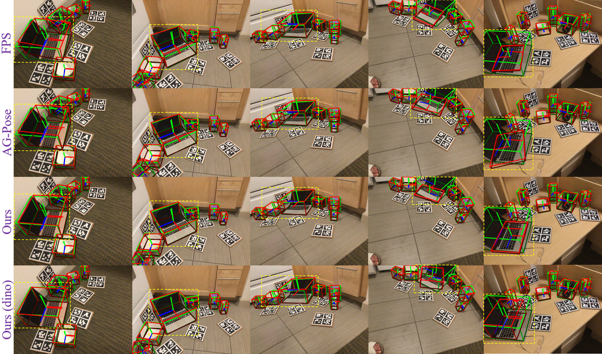
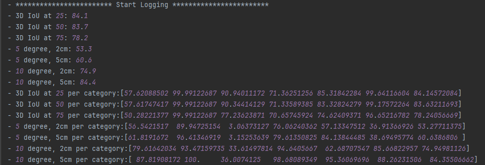

# SDC-Pose: Score-Distance Guided Point Cloud Filtering and Clustered Sparse Keypoints for Category-Level 6D Object Pose Estimation
## Environment Settings
The code has been tested with

- python 3.10
- torch 2.5.0
- cuda 12.1

Some dependencies:
```
pip install gorilla-core==0.2.5.3
pip install opencv-python

cd model/pointnet2
python setup.py install
```
## Data Processing
### NOCS dataset
- Download and preprocess the dataset following [DPDN](https://github.com/JiehongLin/Self-DPDN)
- Download and unzip the segmentation results [here](http://home.ustc.edu.cn/~llinxiao/segmentation_results.zip)

Put them under ```PROJ_DIR/data```and the final file structure is as follows:
```
data
├── camera
│   ├── train
│   ├── val
│   ├── train_list_all.txt
│   ├── train_list.txt
│   ├── val_list_all.txt
├── real
│   ├── train
│   ├── test
│   ├── train_list.txt
│   ├── train_list_all.txt
│   └── test_list_all.txt
├── segmentation_results
│   ├── CAMERA25
│   └── REAL275
├── camera_full_depths
├── gts
└── obj_models
```
## Train
### Training on NOCS
```
python train.py --config config/REAL/camera_real.yaml
```

## Evaluate 
- Evaluate on NOCS:
```
python test.py --config config/REAL/camera_real.yaml --test_epoch 30
```
## Visualization
For visualization, please run
```
python visualize.py --config config/REAL/camera_real.yaml --test_epoch 30
```





## Acknowledgements
Our implementation leverages the code from these works:
- [NOCS](https://github.com/hughw19/NOCS_CVPR2019)
- [SPD](https://github.com/mentian/object-deformnet)
- [DPDN](https://github.com/JiehongLin/Self-DPDN)
- [AG-Pose](https://github.com/Leeiieeo/AG-Pose)

We appreciate their generous sharing.
